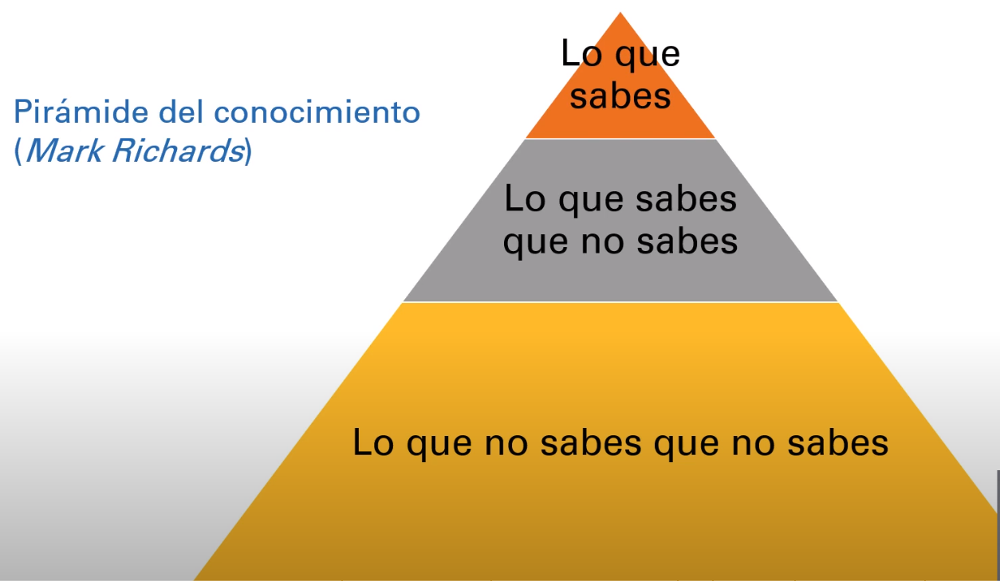
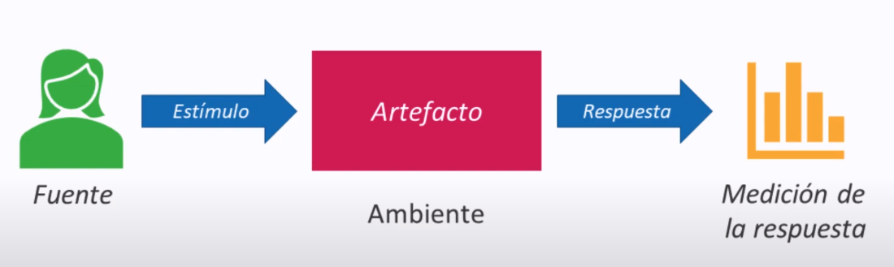

# Arquitectura de Software

La arquitectura de software se refiere al diseño de alto nivel de un sistema de software. Es la representación abstracta y estructurada de cómo diferentes componentes de un software interactúan entre sí y cómo se organizan para lograr los objetivos del sistema. La arquitectura de software establece las bases y las directrices para la construcción del software, y es esencial para garantizar que el software sea eficiente, escalable, mantenible y cumpla con los requisitos funcionales y no funcionales.

> La arquitectura de software es el diseño de más alto nivel de la estructura de un sistema, que consiste en un conjunto de patrones y abstracciones que proporcionan un marco claro para la implementación del sistema.

 

## Indice:

- [Arquitectura de Software](#arquitectura-de-software)
- [Aspectos clave de la arquitectura de software](#aspectos-clave-de-la-arquitectura-de-software)
- [¿Qué hace un arquitecto de software?](#¿qué-hace-un-arquitecto-de-software?)
- [Introducción a la arquitectura de software](#introducción-a-la-arquitectura-de-software)
- [Habilidades blandas (Soft Skills)](#habilidades-blandas-(soft-skills))
- [Atributos de Calidad](#atributos-de-calidad)
  - [¿Cómo medimos un atributo de calidad?](#¿cómo-medimos-un-atributo-de-calidad?)

- [10 Tipos de Arquitectos de Software](#10-tipos-de-arquitectos-de-software)
- [Patrones de arquitectura](#Patrones-de-arquitectura)
  - [Diferencias entre un patrón de arquitectura y un patrón de arquitectura](#diferencias-entre-un-patrón-de-arquitectura-y-un-patrón-de-arquitectura)
  - [Arquitectura por capas](#arquitectura-por-capas)
- [Estilos de arquitectura de software](#estilos-de-arquitectura-de-software)
  - [Comparativa entre un patrón de arquitectura y un estilo de arquitectura de software](#comparativa-entre-un-patrón-de-arquitectura-y-un-estilo-de-arquitectura-de-software)

- [Architectural Katas](#architectural-katas)
- [Bibliografía](#bibliografía)

 

## Aspectos clave de la arquitectura de software

**1. Componentes:** Define los módulos o componentes principales del sistema y cómo se relacionan entre sí. Estos componentes pueden ser módulos de software, servicios, subsistemas, bases de datos, etc.

**2. Estructura:** Describe la organización y la relación entre componentes, incluyendo cómo se comunican y cómo fluye la información entre ellos.

**3. Comportamiento:** Define cómo se ejecuta el software, cómo responde a las entradas y cómo se comporta en diferentes situaciones.

**4. Escalabilidad:** Considera cómo el sistema puede crecer y adaptarse a medida que se requieran más recursos o se agreguen nuevas funcionalidades.

**5. Rendimiento:** Se preocupa por la eficiencia del sistema, incluyendo la velocidad de respuesta, la utilización de recursos y la capacidad de gestionar cargas de trabajo pesadas.

**6. Mantenibilidad:** Evalúa la facilidad con la que el software puede mantenerse a lo largo del tiempo, lo que implica la capacidad de realizar cambios y correcciones de manera eficiente.

**7. Seguridad:** Aborda las medidas de seguridad que se deben implementar para proteger el sistema contra amenazas y vulnerabilidades.

**8. Requisitos no funcionales:** Incluye aspectos como la usabilidad, la disponibilidad, la confiabilidad y otros requisitos que no están relacionados directamente con las funciones principales del software, pero son importantes para su calidad global.

La arquitectura de software puede representarse a través de diversos modelos y diagramas, como diagramas de flujo, diagramas de componentes, diagramas de despliegue, entre otros. El proceso de diseño de la arquitectura de software suele ser una etapa crucial en el desarrollo de proyectos de software, ya que sienta las bases para la implementación y el desarrollo subsiguiente. Una buena arquitectura de software contribuye a la eficiencia del desarrollo, la calidad del producto y la capacidad de mantener y evolucionar el software con el tiempo.

**Estructura:** Cómo organizar las partes del sistema y cómo conectarlas; en esto aplican los patrones de arquitectura como eventos, capas, microservicios; te van a decir qué componentes necesitas y cómo se van a conectar entre ellos.

- **Razonar:** Facilita la idea de dialogar sobre el futuro del software a un alto nivel que facilita la comunicación entre ellos.

- **Decisiones de diseño:** Las decisiones de diseño (cómo van a ir conectados los microservicios o el diseño de la aplicación) deben ir documentadas para comprender y entender cómo llevar a cabo la app.

- **Atributos de calidad:** Existen muchos atributos de calidad que permiten definir qué es lo que va más allá de lo funcional y que permite que el sistema funcione bien.

  "*La arquitectura es acerca de las cosas importantes, no importa qué sean esas cosas".*  ~*Raf Johnson*

> Básicamente, la arquitectura de software es un conjunto de estructuras que determina cómo organizar las partes del sistema y cómo conectarlas; en esto aplican los patrones de arquitectura como eventos, capas, microservicios; te van a decir qué componentes necesitas y cómo se van a conectar entre ellos. Ayuda a facilitar la comunicación y razonar sobre el futuro del software a un alto nivel que facilita la toma de decisiones y el diseño de la aplicación, además de definir atributos de calidad esenciales.

 

## ¿Qué hace un arquitecto de software?

Para ello tendremos en cuenta 11 actividades que relizan todos los arquitectos.

**1. Define y balancea los atributos de calidad:** Por atributos de calidad hacemos referencia a Escalabilidad, Elasticidad, Modificabilidad, Facilidad en el despliege del codigo, son parte fundamental del trabajo del arquitecto. Entonces, su tarea es encontrar esos atributos de calidad que sean relevantes y no solo definirlos, si no balancearlos, sin embargo para tener en cuenta; dentro de más atributos de calidad tenga un sistema, más difícil será de desarrollar y mantener, por ende; su tarea es saber escojer sobre cuales atributos implementar y cuales sacrificar en pro de tener un sistema más eficiente.

**2. Definir el problema desde un punto de vista de ingeniería:** El arquitecto debe de tomar los requerimientos (historias de usuario), atributos de calidad y restrictiones que haya en el diseño, planteando un sistema que resuelva el problema.

**3. Establecer los principios de diseño que guían las desiciones de tecnología de una empresa:**  El arquitecto debe de estar involucrado en cada desición que se lleve a cabo en el proyecto, como el uso de una librería, un patrón, etc. Este arquitecto debe de ser capaz de definir los lineamientos que le faciliten a su equipo de desarrollo ciertas capacidades de diseño y guiarlos como lider en el proceso de la toma de desiciones.

**4. Garantizar el cumplimiento de la arquitectura:** El arquitecto no solo crea o plantea la arquitectura incial y lineamientos del diseño, si no que también debe de involucrarse de alguna forma para garantizar que la arquitectura se cumpla; esto dado que en el proceso de desarrollo de un software, siempre hay pequeños desvios de la arquitectura.

**5. Mantenerse al día de las tendencias tecnológicas y de la industria:** El arquitecto debe de mantenerse al día de lo que marca tendecia a nivel tecnológico y conocer que cosas vienen y qué nuevos desarrollos se están dando. Como el arquitecto también es un componente importante en la parte del negocio, es muy importante que este tenga conocimiento sobre las tendencias en la industria del negocio donde trabaja.

**6. Conocer multimples teconologías, plataformas y ambientes:**  Este conocimiento es fundamental para que el arquitecto conozca muy bien la ruta y de su equipo para poder elegir la estrucruta que ha de implementar y decidir según su conocimiento.

**7. Analizar el entorno y proponer mejoras para que la arquitectura de su sistema se mantenga relevante:** Esto dado que el la tecnología va evolucionando con el tiempo, haciendo que a su ves el software antiguo quede obsoleto y los intereses de los usuarios estén o se mantengan en constante cambio.

**8. Administrar la deuda técnica:** La deuda técnica es la diferencia entre el estado actual del sistema y el estado ideal o que debería de tener. El aquitecto sabe cuando debe de sacrificar algo que debería de tener el software con tal de balancear otras cosas, pero que a su vez debe saber como disminir esa diferencia en la deuda técnica de los sistemas.

**9. Entiende y sabe moverse en el entorno político de la empresa:** Esto dado que el arquitecto es el encargado de tomar las desiociones que afectan directamente al equipo técnico de su empresa si no que también puede afectar muchos cargos en la empresa; dependiendo de como se manejen las desiciones puede cambiar la forma en la que una persona trabaja o pueden desaparecer personas o cargos dentro de la entidad por el impacto de estas decisiones. Entonces, el arquitecto, no solo toma decisiones técnicas a la lijera si no que también entiende el contexto de su posición y de la entidad donde trabaja, conociendo como realizar sus tareas para que tengan el impacto correcto en la organizacion.

**10. Mentoría:** Un arquitecto no solo es el encargado de la estructura del software si no que es el guía, lider y mentor, teniendo la capacidad de transmitir su conocimiento a los demás mienbros del equipo; este se preocupa por el conocimiento de los miembros de su equipo para que mejoren sus capacidades de diseño con el tiempo, dado que el diseño es un ejercisio colaborativo.

**11. Un arquitecto de software desarrolla:** El arquitecto se involucra de alguna forma en el desarrollo del codigo, de alguna forma en la que sea efectivo. Esto para que se exista un seguimiento del rumbo del software y entender las consecuencias de lo que se esté construyendo.

 

# Introducción a la arquitectura de software

 Para convertirte en un arquitecto de sorftware  tendremos en cuenta 3 aspectos importantes:

**Conocimiento:** Según Mark Richards, el conocimiento se divide en tres partes representadas en la siguiente pirámide:

Como desarrollador es importante tener esa profundidad técnica (ampliar la punta de la piramide); si te desemeñas en algo, debes de tener un gran conocimiento en ello. 

Como arquitecto la situación es un poco distinta; para el arquitecto lo que más importa es la amplitud, ya no interesa tanto ser un experto en una sola herramienta, si no que conocer de muchas herramientas, abarcando así la capa de lo que sabes que no sabes.

Puntualmente se debe de conocer multiples plataformas, teconologías, ambientes y lenguajes, saliendote así de tu forma de confort probando algo distinto.

1. **Ampliar tu conocimiento**, conocer mulltiples plataformas, tecnológias ambientes y lenguajes

2. **Conocer los atributos de calidad**, también conocidos como requerimientos no funcionales o caracteríasticas de arquitectura, esto incluye lo siguiente:

   | Atributo de Calidad     | Descripción                                                  |
   | ----------------------- | ------------------------------------------------------------ |
   | Agilidad                | Adaptación rápida a cambios y requerimientos.                |
   | Confiabilidad           | Funcionamiento sin errores y protección de datos.            |
   | Desplegabilidad         | Facilidad de implementación y actualización.                 |
   | Disponibilidad          | Garantía de funcionamiento cuando se necesita.               |
   | Escalabilidad           | Capacidad para crecer sin degradación del rendimiento.       |
   | Facilidad de desarrollo | Simplificación del proceso de creación y mantenimiento.      |
   | Interoperabilidad       | Capacidad para interactuar con otros sistemas.               |
   | Mantenibilidad          | Facilita la modificación, reparación y mejora.               |
   | Modificabilidad         | Facilidad para realizar cambios sin afectar el sistema.      |
   | Portabilidad            | Ejecución en diferentes plataformas sin modificaciones.      |
   | Rendimiento             | Ofrecer alta velocidad y eficiencia.                         |
   | Seguridad               | Protección contra amenazas y seguridad de datos.             |
   | Testeabilidad           | Facilita la realización de pruebas y detección de problemas. |
   | Usabilidad              | Facilita la interacción efectiva y satisfactoria de los usuarios. |

    

3. **Patrones de arquitectura y de Diseño** 

   | Patrón de Diseño                   | Descripción                                                  |
   | ---------------------------------- | ------------------------------------------------------------ |
   | Patrón Singleton                   | Garantiza una única instancia de una clase.                  |
   | Patrón Factory                     | Crea objetos sin especificar su clase concreta.              |
   | Patrón Builder                     | Construye objetos complejos paso a paso.                     |
   | Patrón Prototype                   | Clona objetos existentes para crear nuevos.                  |
   | Patrón Adapter                     | Permite que interfaces incompatibles trabajen juntas.        |
   | Patrón Decorator                   | Añade responsabilidades a objetos de forma dinámica.         |
   | Patrón Observer                    | Define una dependencia uno a muchos entre objetos.           |
   | Patrón Strategy                    | Permite seleccionar algoritmos en tiempo de ejecución.       |
   | Patrón Command                     | Encapsula una solicitud como un objeto.                      |
   | Patrón Template Method             | Define el esqueleto de un algoritmo, dejando algunos pasos a las subclases. |
   | Patrón State                       | Permite que un objeto altere su comportamiento cuando su estado cambia. |
   | Patrón Composite                   | Compone objetos en estructuras de árbol para representar jerarquías. |
   | Patrón Proxy                       | Proporciona un sustituto o representante de otro objeto.     |
   | Patrón Chain of Responsibility     | Encadena objetos para manejar una solicitud secuencialmente. |
   | Patrón MVC (Model-View-Controller) | Divide una aplicación en tres componentes: Modelo, Vista y Controlador. |

    

4. **Inregración y entrega continua**: Tiempos reservados de pequeñas entregas (modulos/sprints) para llevar un control del desarrollo del aplicativo.

5. **Experiencia como desarrollador** (idealmente fullstack)

6. **Habilidades Blandas, Soft skills, people skills**

   | Tema                     | Descripción                                                  |
   | ------------------------ | ------------------------------------------------------------ |
   | Liderazgo                | Habilidad para guiar, motivar y dirigir un grupo o equipo hacia metas y objetivos comunes. Involucra la toma de decisiones y la gestión de personas. |
   | Comunicación             | Capacidad para transmitir ideas, pensamientos y mensajes de manera efectiva y comprensible. Implica escuchar, expresarse y adaptarse al público. |
   | Negociación              | Habilidad para llegar a acuerdos mutuamente beneficiosos al tratar con conflictos, intereses opuestos o diferencias de opinión. |
   | Trabajo en equipo        | Capacidad para colaborar y coordinar esfuerzos con otros para lograr metas comunes. Involucra la comunicación, la empatía y la resolución de conflictos. |
   | Pragmatismo              | Enfoque filosófico que prioriza la utilidad y la eficacia práctica en la toma de decisiones y la búsqueda de la verdad, en lugar de abstracciones teóricas. |
   | Capacidad de abstracción | Habilidad para simplificar información, identificar patrones y conceptos generales a partir de detalles y datos específicos. Facilita la comprensión y el pensamiento conceptual. |

 

# Habilidades blandas (Soft Skills)

Dado que el arquitecto es el líder de todo un equipo, su capacidad de comunicación debe ser superior para el entendimiento de todos en la entidad, comprender, adaptarse y liderar es fundamental para poder resolver los conflictos que se presenten en su trayectoria como líder.

- **Liderazgo**: Capacidad para guiar, motivar y dirigir un grupo o equipo hacia metas y objetivos comunes.

- **Comunicación**: Habilidad para transmitir ideas, pensamientos y mensajes de manera efectiva y comprensible.

- **Negociación**: Habilidad para llegar a acuerdos mutuamente beneficiosos al tratar con conflictos, intereses opuestos o diferencias de opinión.

- **Trabajo en equipo:** Capacidad para colaborar y coordinar esfuerzos con otros para lograr metas comunes.

- **Pragmatismo**: Enfoque filosófico que prioriza la utilidad y la eficacia práctica en la toma de decisiones y la búsqueda de la verdad.

- **Capacidad de abstracción:** Habilidad para simplificar información, identificar patrones y conceptos generales a partir de detalles y datos específicos.

   

# Atributos de Calidad

Característica o propiedad que describe cómo un sistema o software se comporta en términos de su desempeño, eficacia y capacidad para satisfacer las necesidades del usuario y las expectativas. Estos atributos son esenciales para evaluar la calidad y el rendimiento de un sistema o aplicación.

También denominado ***Característica de arquitectura***, es una propiedad medible del sistema que indica cuán bien satisface a cada una de las partes interesadas.

Pero...

## ¿Cómo medimos un atributo de calidad?

Bueno, el escenario de un atributo de calidad se divide en tres partes.

1. **Fuente:** La fuente es la entidad que genera un estímulo que afecta al sistema. Puede ser un usuario, otro sistema, un dispositivo, etc.
2. **Artefacto:** El artefacto se refiere a la parte del sistema que está siendo evaluada en relación con el atributo de calidad. Puede ser el código fuente, una base de datos, un componente específico, etc.
3. **Respuesta:** La respuesta es la reacción del sistema ante el estímulo de la fuente. La medida de la respuesta permite evaluar el atributo de calidad en cuestión.

Los siguientes son los atributos más conocidos y más importantes:

| Atributo              | Descripción                                                  |
| --------------------- | ------------------------------------------------------------ |
| **Desplegabilidad**   | Ayuda a definir qué tan fácil es desplegar una nueva versión de la aplicación en producción. |
| **Disponibilidad**    | Habla acerca de si el sistema está listo o no para atender una solicitud en el momento en que uno lo espera. |
| **Escalabilidad**     | Trata de que con el tiempo el sistema sea capaz de soportar cada vez mayores cargas. |
| **Interoperabilidad** | Qué tan bien el sistema puede intercambiar datos con otros sistemas. |
| **Modificabilidad**   | Cuál es el costo de hacer un cambio en el sistema; qué tan rápido lo puedo hacer y qué tantos recursos necesito. |
| **Rendimiento**       | Es si el sistema hace lo que se espera que haga en un tiempo esperado para nuestros usuarios. |
| **Seguridad**         | Es la capacidad de un sistema para proteger los datos de accesos no autorizados y permitir el acceso a partes autorizadas. |
| **Testeabilidad**     | Qué tan fácil es hacer la prueba de un sistema.              |
| **Usabilidad**        | Qué tan fácil un usuario puede realizar las tareas en un sistema. |

 

# 10 Tipos de Arquitectos de Software

:warning: **<i>Nota Importante</i>:** En distintas empresas, los roles y las responsabilidades de los arquitectos de software pueden variar. Las siguientes descripciones ofrecen una visión general de estos roles.*

**1. Arquitecto Empresarial**

- **Enfoque**: Alinea el software con la estrategia empresarial y analiza cómo los usuarios utilizan el software en los procesos de negocio.
- **Responsabilidades**: Define la comunicación con sistemas externos y analiza cómo los usuarios utilizan el software en los procesos de negocio.

**2. Arquitecto de Soluciones**

- **Enfoque**: Convierte requisitos en una arquitectura efectiva y colabora estrechamente con analistas de negocio y propietarios de productos.
- **Responsabilidades**: Convierte los requisitos en una arquitectura efectiva, colabora con analistas de negocio y propietarios de productos, y diseña conexiones entre sistemas y facilita la comunicación entre equipos.

**3. Arquitecto de Software por Dominio**

- **Enfoque**: Especializado en un área técnica particular y se centra en diseñar el sistema basado en requisitos específicos.
- **Responsabilidades**: Selecciona tecnologías para la implementación de componentes y define estándares.

**4. Arquitecto de Aplicación**

- **Enfoque**: Se enfoca en aplicaciones específicas o conjuntos de aplicaciones, como un arquitecto del sistema contable.
- **Ejemplos**: Arquitecto del sistema contable, Arquitecto de la aplicación XYZ.

**5. Arquitecto por Lenguaje**

- **Enfoque**: Se especializa en un lenguaje de programación específico, como un arquitecto .NET o un arquitecto Java.
- Común en empresas de desarrollo a medida.
- **Ejemplos**: Arquitecto .NET, Arquitecto JAVA.

**6. Arquitecto por Capa**

- **Enfoque**: Se especializa en una capa específica del sistema, como un arquitecto Front-end o un arquitecto Móvil.
- **Ejemplos**: Arquitecto Front-end, Arquitecto Móvil, Arquitecto iOS, Arquitecto Android.

**7. Arquitecto Cloud**

- **Enfoque**: Se especializa en soluciones basadas en la nube y puede ser un arquitecto AWS o un arquitecto Azure.
- **Ejemplos**: Arquitecto AWS, Arquitecto Azure.

**8. Arquitecto de Infraestructura**

- **Enfoque**: Asegura que el software sea compatible con la infraestructura y trabaja con servidores, dispositivos de red y sistemas de almacenamiento.

**9. Arquitecto de Seguridad**

- **Enfoque**: Se enfoca en la seguridad del sistema y realiza pruebas de vulnerabilidad e implementa estándares de seguridad.

**10. Arquitecto de Datos**

- **Enfoque**: Diseña, despliega y administra los datos de una empresa, incluida la estructura y el rendimiento de las bases de datos.
- Este formato hace que la información sea más clara y fácil de asimilar. ¿Necesitas alguna otra mejora en el formato o contenido adicional?

**11. Arquitecto de Información**

- **Enfoque en Usuarios:** Se centra en comprender a los usuarios y cómo los datos afectan su experiencia con el sistema.
- **Pruebas de Usabilidad:** Realiza pruebas de usabilidad para evaluar la facilidad de uso y la satisfacción del usuario.
- **Colaboración con Diseñadores:** Trabaja en estrecha colaboración con diseñadores para mejorar la experiencia del usuario (UX).

Estos son algunos de los tipos de arquitectos de software que existen en la industria, y cada uno tiene sus propias responsabilidades y áreas de especialización.

 

# Patrones de arquitectura

Es la solución general y reutilizable para un conjunto común de problemas en el diseño y desarrollo de sistemas de software. Estos patrones proporcionan una estructura y una guía para resolver problemas específicos de arquitectura de software de manera eficiente y efectiva.

> :bulb: **En conclusión**
>
> Son soluciones o estructuras que ayudan a definir la aplicación desde un nivel mayor.
> A diferencia de un patrón de diseño que soluciona un problema en particular.
> Estos patrones nos ayudan a definir el lineamiento para poder empezar a definir la aplicación

### Diferencias entre un patrón de arquitectura y un patrón de arquitectura.

Los patrones de arquitectura a diferencia de los patrones de diseño tienen un impacto global sobre la aplicación, mi entras que los patrones de diseño se enfocan en algo objetivo y concreto, los patrones de arquitectura se enfocan en un un objetivo de más alto nivel.

Los patrones de arquitectura pueden regir la comunicación entre componentes, por ello cualquier cambio que se realice tendrá un impacto directo sobre el componente, en incluso podría afectas a otros componentes relacionados.

> :bulb: **En resumen**
>
> Los patrones de arquitectura son los que nos ayudan a definir la estructura del sistema y ubicar donde van cada uno de los componentes y capas.

 

Como por ejemplo:

### Arquitectura por capas

Es un enfoque de diseño de software que organiza una aplicación en múltiples capas o niveles lógicos, donde cada capa tiene una responsabilidad específica y se comunica con las capas adyacentes a través de interfaces definidas. Estas capas están diseñadas para ser independientes y modulares, lo que facilita la gestión, le mantenimiento y la escalabilidad del software.

Las capas típicas de una arquitectura por capas son:

- **Presentación**: Capa en cargada de la interfaz e interacción con el usuario. Aquí se encuentran elementos como la interfaz gráfica, la lógica de presentación y la captura de entrada del usuario.
- **Lógica de negocio:** En esta capa se implementa la logica del negocio de la aplicación. Aquí se procesan los datos y se aplican las reglas de negocio. Esta capa es independiente de la interfaz de usuario.
- **Acceso a datos**: Encargada de interactuar con las bases de datos o cualquier otro almacenamiento de datos. Realiza operaciones de lectura y escritura de datos.
- **Infraestructura o servicios:** Se encuentran los servicios y componentes que son compartidos por todas las capas. como la gestión de sesiones, autenticación, seguridad y otros aspectos técnicos de la aplicación.

 

### Otros ejemplos de patrones de arquitectura

- **Modelo-Vista-Controlador (MVC)**: Divide una aplicación en tres componentes principales (modelo, vista y controlador) para separar la lógica de presentación y la lógica de negocio.
- **Cliente-Servidor**: Divide un sistema en un servidor central que proporciona servicios y clientes que los utilizan para distribuir la carga y facilitar la escalabilidad.
- **Arquitectura Orientada a Servicios (SOA)**: Organiza aplicaciones como servicios independientes que se comunican a través de interfaces estándar.
- **Microservicios**: Divide una aplicación en componentes pequeños e independientes que pueden desplegarse y escalar de forma independiente.
- **Arquitectura en Capas**: Divide una aplicación en capas lógicas, como la capa de presentación, la capa de lógica empresarial y la capa de acceso a datos.
- **Arquitectura Hexagonal (Puertos y Adaptadores)**: Define un núcleo central que contiene la lógica de la aplicación, rodeado de adaptadores que interactúan con diferentes interfaces.

> :bulb: **En Resumen**
>
> Los patrones de diseño entran a solucionar problemas específicos dentro de los patrones de arquitectura.

 

# Estilos de arquitectura de software

Es una forma específica de diseñar la estructura y la organización de un sistema de software. A diferencia de un patrón de arquitectura que es una solución general y reutilizable para un conjunto de problemas, un estilo de arquitectura es una especificación más detallada que define cómo se deben organizar los componentes y cómo deben interactual dentro del sistema.

Los estilos de arquitectura son útiles para abordar ciertos tipos de sistemas o aplicaciónes que tienen requisitos específicos y características particulares. 

> :bulb: **En otras palabas**
>
> Es un método específico de construción, caracterizado por las características que lo hacen notable y se distingue por las características que hacen que un edificio u otra estructura sea notable o históriacemente identificable.
>
> Un estilo de arquitectura determina las características que debe tener un componente que utilice ese estilo, lo cual hace que sea fácilmente reconocible. De la misma forma que podemos determinar a qué periodo de la historia pertenece una construcción al observar sus características físicas, materiales u observar sus métodos de construcción, en el software podemos determinar qué estilo de arquitectura sigue un componente al observar sus características. 

 

## Comparativa entre un patrón de arquitectura y un estilo de arquitectura de software

Tanto los patrones de arquitectura como los estilos de arquitectura son conceptos utilizados en el diseño y desarrollo de sistemas de software, y comparten similitudes en su enfoque, pero también tienen diferencias clave:

| Aspecto             | Patrón de Arquitectura                                       | Estilo de Arquitectura                                       |
| ------------------- | ------------------------------------------------------------ | ------------------------------------------------------------ |
| Tipo de Solución    | Solución específica para un problema particular.             | Enfoque general para la organización del sistema.            |
| Nivel de Detalle    | Detallado y específico.                                      | Más alto nivel de abstracción.                               |
| Aplicabilidad       | Limitado a situaciones específicas.                          | Puede utilizarse en una variedad de contextos.               |
| Ejemplos            | Ejemplos incluyen MVC, Singleton, Factory Method.            | Ejemplos incluyen Arquitectura en Capas, Cliente-Servidor, Arquitectura Orientada a Servicios. |
| Uso de Componentes  | Define cómo se estructuran y comunican componentes específicos. | Define cómo se organizan los componentes en un nivel alto sin entrar en detalles. |
| Problemas Abordados | Se centran en soluciones para problemas concretos.           | Se centran en la organización general de un sistema.         |
| Reutilización       | Promueve la reutilización de diseños específicos.            | Promueve la reutilización de enfoques generales.             |
| Ejemplos Comunes    | Singleton para controlar la instancia única de una clase.    | Arquitectura en capas para separar la lógica de presentación y la lógica de negocio. |
| Flexibilidad        | Menos flexible, ya que se aplica a situaciones específicas.  | Más flexible, ya que puede adaptarse a diferentes contextos. |

> :bulb: **En resumen**
>
> Un **estilo de arquitectura de software** es un enfoque general para organizar y estructurar un sistema, proporcionando directrices de alto nivel. Los estilos son más flexibles y aplicables en varios contextos. en comparación, un **patrón de arquitectura** es una solución específica y detallada para un problema en particular. Ambos promueven la reutilización, pero los patrones son más limitados en su aplicabilidad y se centran en problemas concretos.
>
> Es un marco de referencia establece un marco de referencia a parttir del cual es posible construir aplicaciones que comparten un conjunto de atributos y características mediante el cual es posible identificarlos y clasificarlos.

 

# Architectural Katas

Es una actividad donde se asigna un ejercicio para el cual hay que definir la arquitectura y esto normalmente se realiza en grupos de 3 a 5 personas. 

Es un espacio donde se practica de manera grupal o individual una serie de movimientos, siendo un pequeño espacio donde puedes perfeccionar tu arte, antes de enfrentar un desafío o un reto real.

### <u>Reglas:</u>

- **Moderador**: Persona que a veces tomará el rol de cliente, jefe, gerente de proyectos, etc. Es la persona que nos va a aclarar las inquietudes que no queden resueltas a partir de las reglas de una kata y a partir del ejercicio estemos trabjando. 

- **Se trabajará en 4 Fases.** 

  - **Fase de preparación:** Lo ideal de estos ejercicios es que trabajes con personas diferentes que piensen de forma diferente. Además que se evite el uso de computadores y se utilice más bien pliegos de papel, post-its, marcadores, etc. La idea es que sea un elemento donde nos sentemos a pensar en vez de buscar las soluciones predefinidas en internet.

  - **Fase de discución:** Vamos a analizar los requerimientos de la kata y vamos a  trabajar en la arquitectura por el tiempo que esté definido según las reglas, entonces ahí podemos hacer preguntas al moderador y vamos a hacer supuestos sobre las tecnologias que vamos a utiilizar.

  - **Fase de presentación:**  Cada grupo presententa cual fué la solución a la kata que estaba trabajando, por ejemplo se puede mostrar: la arquitectura, las tecnologías y en general cuál fué el proceso. 

    >  :bulb:   <u>Recomendado</u>
    >
    > Utilizar el modelo C4 para realizar la presentación de la arquitectura el cual permite mostrar la arquitectura en varios niveles y mostrar las decisiones de diseño relevantes

  - **Votación:** Todas las personas presentes en la votación votan con manita arriba si salió muy bien la kata, y si no cumplió con las espectativas. 

    Luego de la votación, entra un feed back colectivo sobre lo que se realizó

**<u>REFERENCIAS:</u>**

En esta página se explica al detalle este pequeño juego:   [Katas](https://www.architecturalkatas.com/)

 

# Bibliografía

- [Introducción a la arquitectura de Software](https://www.youtube.com/watch?v=7ukajubprdE&list=PLFHx3afTdaY0hvX2NXRxMVM3j5sk-3aE3&index=2&ab_channel=ManuelZapata)
- [11 Actividades que hace un arquitecto de software](https://www.youtube.com/watch?v=rWh7RtVJzhA&list=PLFHx3afTdaY0hvX2NXRxMVM3j5sk-3aE3&index=3&ab_channel=ManuelZapata)
- [Cómo convertirte en un arquitecto de software](https://www.youtube.com/watch?v=oowwFLK_G4c&list=PLFHx3afTdaY0hvX2NXRxMVM3j5sk-3aE3&index=4&ab_channel=ManuelZapata)
- [7 soft skill Cruciales de un arquitecto de software](https://www.youtube.com/watch?v=wXqIsl_XSOg&list=PLFHx3afTdaY0hvX2NXRxMVM3j5sk-3aE3&index=5&ab_channel=ManuelZapata)
- [Atributos de calidad del software](https://www.youtube.com/watch?v=NmRuhzyKCWM&list=PLFHx3afTdaY0hvX2NXRxMVM3j5sk-3aE3&index=6&ab_channel=ManuelZapata)
- [10 tipos de arquitectos de software](https://www.youtube.com/watch?v=FlMa5U2tRhE&list=PLFHx3afTdaY0hvX2NXRxMVM3j5sk-3aE3&index=7&ab_channel=ManuelZapata)
- [Architectural Katas](https://www.youtube.com/watch?v=1UtuR0HpN7s&list=PLFHx3afTdaY0hvX2NXRxMVM3j5sk-3aE3&index=8&ab_channel=ManuelZapata)

